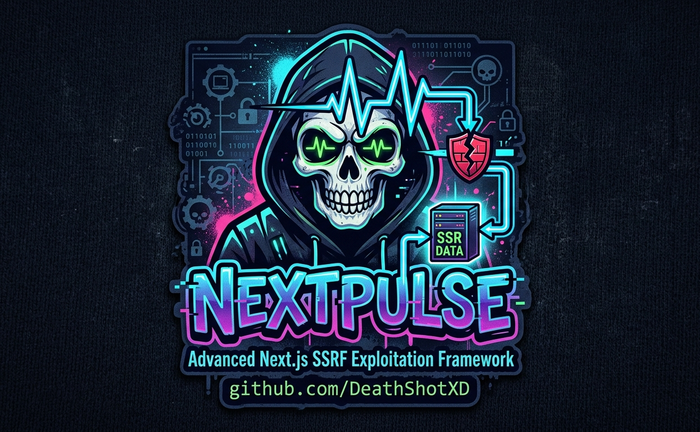
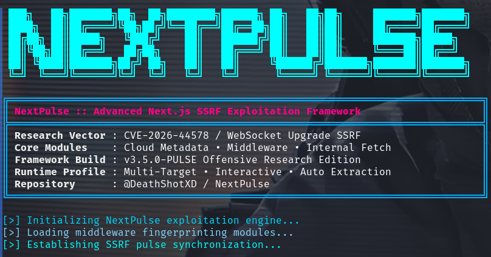
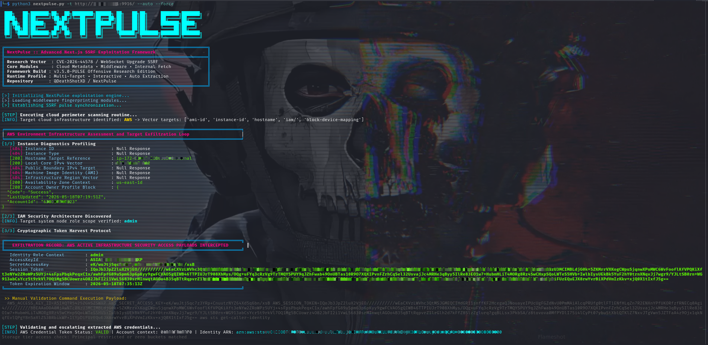
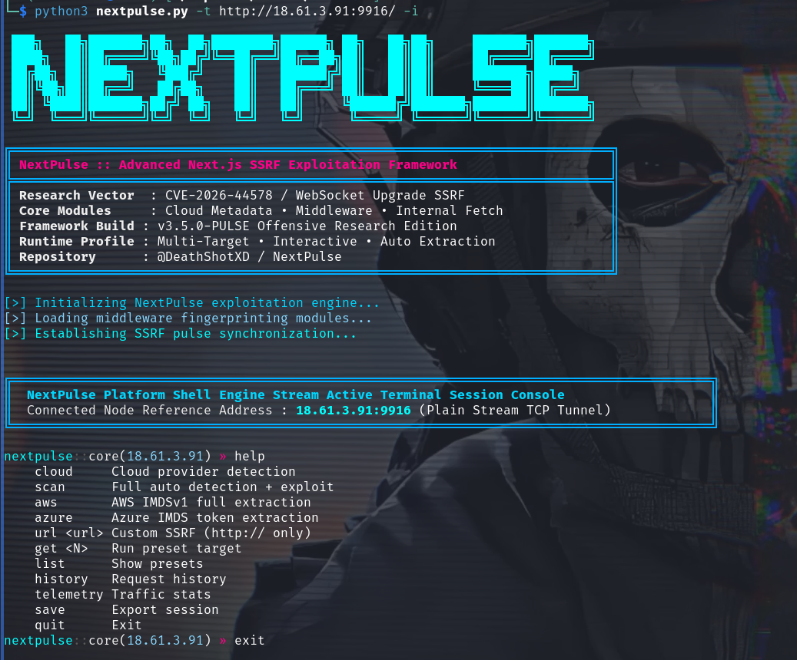
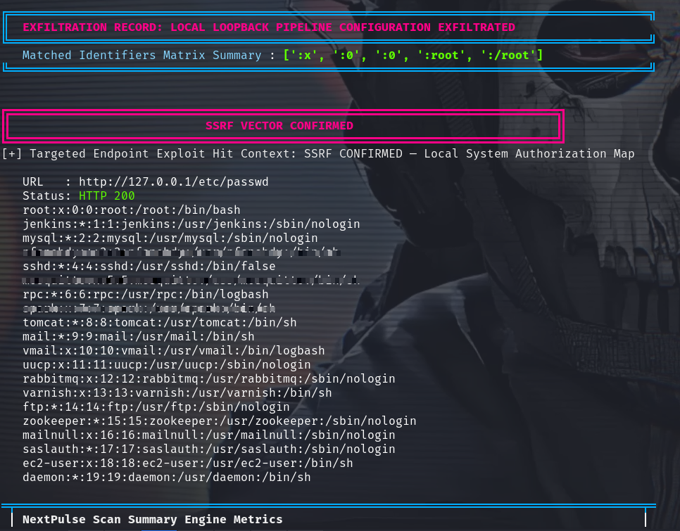

# NextPulse | Advanced Next.js SSRF Exploitation Framework


**CVE-2026-44578 | WebSocket Upgrade Handler SSRF**



## Affected Versions

- Next.js 13.4.13 → 15.5.15
- Next.js 16.0.0 → 16.2.4

## Fixed Versions

- 15.5.16
- 16.2.5 (self-hosted only)

---

## Overview

NextPulse is a professional SSRF exploitation framework designed for the Next.js WebSocket Upgrade Handler vulnerability (CVE-2026-44578).

---

## Attack Surface Coverage

- Advanced WebSocket smuggling
- Header randomization & evasion
- Cloud metadata extraction
- Local environment exfiltration
- Automated credential validation
- Interactive operator shell
- Multi-threaded mass scanning

Built for:

- Security Researchers
- Bug Bounty Hunters
- Red Team Operators
- Offensive Security Engineers

---

## Features

- Accurate Next.js fingerprinting & version detection
- Intelligent vulnerability confirmation
- WebSocket Upgrade SSRF exploitation
- WAF-aware request shaping & evasion
- AWS IMDSv1 exploitation & credential extraction
- Azure Managed Identity token extraction
- GCP / DigitalOcean / Oracle / Alibaba support
- Kubernetes metadata targeting
- Local Environment Exfiltration (LEEx)
- AWS credential validation via boto3
- Automated S3 bucket enumeration
- Interactive shell mode
- JSON / JSONL session export
- Multi-threaded high-speed scanning
- Single-file deployment architecture

---

## Installation

```bash
git clone https://github.com/DeathShotXD/NextPulse.git
cd NextPulse
pip3 install -r requirements.txt
chmod +x nextpulse.py
```

---

## Requirements

- Python 3.10 or higher
- boto3 for AWS credential validation features

---

## Usage

### Basic Scan

```bash
python3 nextpulse.py -t https://target.com
```

### Interactive Mode

```bash
python3 nextpulse.py -t https://target.com -i
```

### Automatic Exploitation

```bash
python3 nextpulse.py -t https://target.com --auto --force
```

### Mass Scanning

```bash
python3 nextpulse.py -f targets.txt --threads 50 --cloud all
```

### Pipe Mode

```bash
cat targets.txt | python3 nextpulse.py --pipe
```

### Custom SSRF Target

```bash
python3 nextpulse.py \
-t https://target.com \
--ssrf "http://169.254.169.254/latest/meta-data/iam/security-credentials/"
```

---

## Interactive Shell Commands

| Command | Description |
|---|---|
| `help` | Show available commands |
| `cloud` | Detect cloud provider |
| `aws` | Full AWS IMDS extraction |
| `azure` | Azure token extraction |
| `scan` | Automated exploitation routine |
| `url <http://...>` | Custom SSRF request |
| `get <N>` | Execute preset target |
| `list` | Show preset SSRF targets |
| `history` | Show request history |
| `telemetry` | Display traffic statistics |
| `save` | Export session |
| `quit` | Exit interactive shell |

---

## Screenshots

### 🔹 Terminal Banner


### 🔹 Cloud Metadata Extraction Flow


### 🔹 Interactive Operator Mode


### 🔹 Local Environment Exfiltration


> All outputs are real-time execution snapshots from controlled testing environments.

---

## Directory Structure

```text
NextPulse/
├── nextpulse.py
├── requirements.txt
├── README.md
├── LICENSE
├── .gitignore
├── logo.png
└── screenshots/
    ├── aws-extraction.png
    ├── interactive.png
    └── localfile-exfil.png
```

---

## Threat Model

This framework evaluates exposure conditions arising from:

- Misconfigured server side request handling
- Unsafe URL forwarding in middleware layers
- Internal service routing exposure
- Cloud metadata endpoint reachability
- WebSocket upgrade request handling inconsistencies

It assumes usage only in authorized security testing environments.

---

## Detection and Defensive Guidance

Potential indicators of exposure include:

- Requests to internal metadata IP ranges
- Unexpected internal DNS resolution from server side components
- Abnormal WebSocket upgrade traffic patterns
- Repeated probing of internal service endpoints
- Unauthorized access attempts to system level files or environment variables

Recommended mitigations:

- Restrict access to metadata services at network level
- Enforce modern metadata authentication mechanisms
- Validate and sanitize server side fetch operations
- Block internal IP ranges from application layer requests
- Monitor middleware request logs for abnormal routing behavior

---

## Performance Profile

- Lightweight single file architecture
- Multi threaded scanning engine
- Adaptive timeout handling
- Minimal dependency footprint
- Real time response classification

---

## Research Positioning

NextPulse is a security research framework intended for vulnerability analysis and defensive validation.

It is designed to support understanding of SSRF conditions in modern web architectures and cloud environments.

It should only be used in authorized environments.

---

## Reproducibility

All scanning and detection logic is designed for controlled environments and can be reproduced using:

- local lab environments
- intentionally vulnerable Next.js deployments
- cloud metadata simulation environments

---

## Author

Syed Wajeeh-ul-Hassan Rizvi (@DeathShotXD)

---

## Disclaimer

This project is intended strictly for:

- Authorized Security Research
- Defensive Validation
- Educational Purposes
- Approved Penetration Testing

Unauthorized usage against systems without explicit permission may violate laws and regulations.

Users are solely responsible for ensuring lawful usage.

---

## License

MIT License

See the `LICENSE` file for full license text.

---

## GitHub Topics

```text
ssrf
nextjs
nextjs-security
bugbounty
redteam
offensivesecurity
cloud-security
pentesting
cybersecurity
research
```

---

## Star The Repository

If you find this project useful, consider starring the repository.
